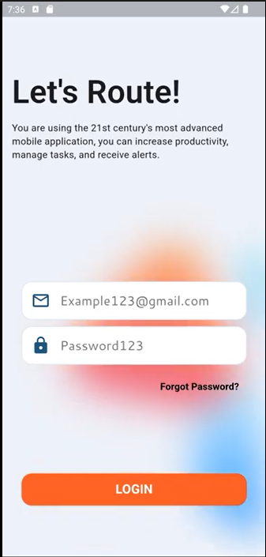
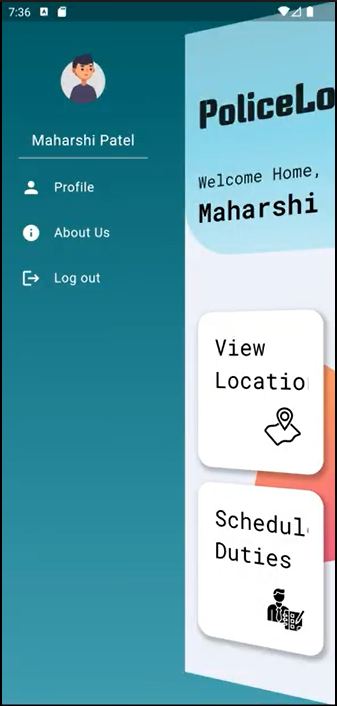

# 🚔 PoliceLookout

PoliceLookout is a **Flutter + IoT-powered mobile application** designed for **real-time RFID-based tracking of officials**.  
It ensures accurate monitoring of visitations, with **separate dashboards for officials and admins**.  

---

## 📽️ Project Showcase

### Images

<div align="center">
<table>
<tr>
<td>

</td>
<td style="padding-left: 30px;">

</td>
</tr>
</table>
</div>


### Link to Video
[🎥 Watch Demo Video](https://drive.google.com/file/d/1UR08bEyJNY1MY-K1oBZVRIqhlDZx7QTc/view?usp=drivesdk)

---

## ✨ Features

- 📡 **Real-time RFID Tracking** – Track 500+ officials with 99.9% accuracy  
- 🔗 **IoT Integration** – RFID-based attendance & duty monitoring  
- ⚡ **High Performance** – Processes 1,000+ logs daily  
- 👨‍💻 **Role-specific Interfaces** – Separate apps/dashboards for Officials & Admins  
- 📊 **Admin Oversight** – Task delegation, log analysis, and real-time monitoring  

---

## 🛠 Tech Stack

- **Mobile App:** Flutter, Dart, Material UI  
- **Backend:** REST API  
- **Database:** MySQL  
- **IoT Hardware:** RFID with ESP32/ESP8266  
- **Others:** JSON, HTTP, GitHub  

---

- **Officials**: Use RFID cards to log visits.  
- **Admins**: Monitor logs, verify duties, assign tasks.  

---

## 🚀 Installation & Setup

### Prerequisites
- Flutter SDK installed  
- MySQL database  
- REST API server configured  
- IoT device (RFID module + ESP32/ESP8266)  

### Steps
```bash
# Clone the repository
git clone https://github.com/Nobodyyisme/PoliceLookout.git
cd PoliceLookout

# Install dependencies
flutter pub get

# Run the app
flutter run


## 📂 Project Architecture

